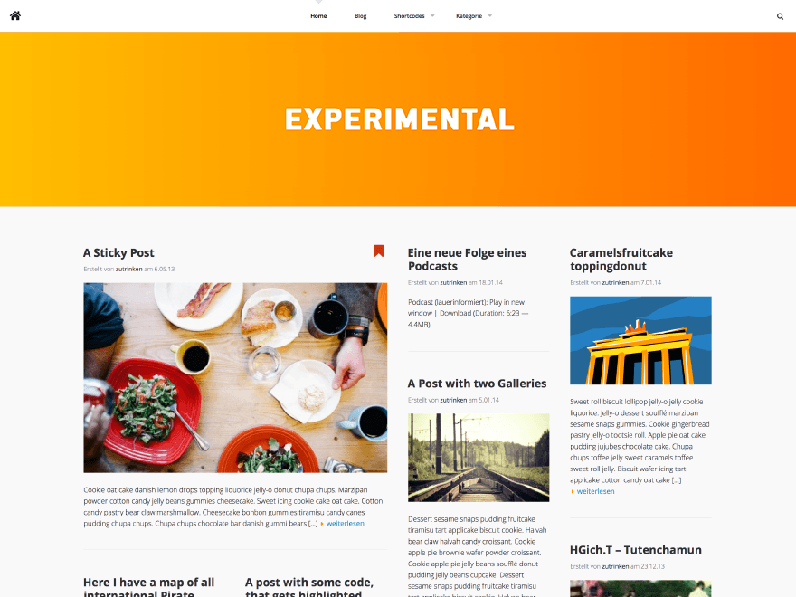

# Oblivion

Yet another wordpress theme.

* Author: [Peter Amende](http://zutrinken.com/)
* License: MIT License

[](https://flattr.com/submit/auto?user_id=zutrinken&url=https://github.com/zutrinken/oblivion&title=oblivion&language=php-js-html-css&tags=github&category=software)

## Version

v0.9 <font color="red">**BETA**</font>

## Screenshot



## Credits

Font **PoliticsHeadBold** by [Fred Bordfeld](http://kaklotter.de/)  
Font **Awesome** by [Dave Gandy](https://github.com/FortAwesome/Font-Awesome)  
Script **Highlight.js** by [Ivan Sagalaev](https://github.com/isagalaev/highlight.js)  
Script **FitVids** by [Dave Rupert](https://github.com/davatron5000/FitVids.js)  

## Copyright & License

Copyright (C) 2014 Peter Amende - Released under the MIT License.

Permission is hereby granted, free of charge, to any person obtaining a copy of this software and associated documentation files (the "Software"), to deal in the Software without restriction, including without limitation the rights to use, copy, modify, merge, publish, distribute, sublicense, and/or sell copies of the Software, and to permit persons to whom the Software is furnished to do so, subject to the following conditions:

The above copyright notice and this permission notice shall be included in all copies or substantial portions of the Software.

THE SOFTWARE IS PROVIDED "AS IS", WITHOUT WARRANTY OF ANY KIND, EXPRESS OR IMPLIED, INCLUDING BUT NOT LIMITED TO THE WARRANTIES OF MERCHANTABILITY, FITNESS FOR A PARTICULAR PURPOSE AND
NONINFRINGEMENT. IN NO EVENT SHALL THE AUTHORS OR COPYRIGHT HOLDERS BE LIABLE FOR ANY CLAIM, DAMAGES OR OTHER LIABILITY, WHETHER IN AN ACTION OF CONTRACT, TORT OR OTHERWISE, ARISING FROM, OUT OF OR IN CONNECTION WITH THE SOFTWARE OR THE USE OR OTHER DEALINGS IN THE SOFTWARE.

## How to

* Required Wordpress 3.5 or higher
* For blurred background images in single and page posts your server needs a "bundled Version" of the PHP DG Library
* Regenerate your images with the [Regenerate Thumbnails](http://wordpress.org/plugins/regenerate-thumbnails/) Plugin
* Set a logo-icon and a full logo in the theme options
* Static page as frontpage displays only posts with featured image and the sidebar
* Display videos like post images by using the custom field ```video``` with your embedded ```<iframe>``` code
* Use shortoceds to format your pages width columns

## Shortcodes

### Columns

It's possible to create ````[two_````, ````[three_```` or ````[four_```` columns. The last column of an column group needs the attribute ````_last]````. Every column group has to be completed with a ````[divider]```` to clear the floating. Also The basic syntax for three columns is:

	[three_columns_one]
	 first column content here...
	[/three_columns_one]
	[three_columns_one]
	 second column content here...
	[/three_columns_one]
	[three_columns_one_last]
	 third column content here...
	[/three_columns_one_last]
	[divider]

The first number ````[three_```` defines the grid and the second numer ````_one]```` the column width. Mind that every column also need its close tag. As the example above you can build other columns with the following paramenters:

#### 2 Columns

1-1 Columns: ````[two_columns_one][two_columns_one_last]````

#### 3 Columns

1-1-1 Columns: ````[three_columns_one][three_columns_one][three_columns_one_last]````

1-2 Columns: ````[three_columns_one][three_columns_two_last]````

2-1 Columns: ````[three_columns_two][three_columns_one_last]````

#### 4 Columns

1-1-1-1 Columns: ````[four_columns_one][four_columns_one][four_columns_one][four_columns_one_last]````

1-1-2 Columns: ````[four_columns_one][four_columns_one][four_columns_two_last]````

1-2-1 Columns: ````[four_columns_one][four_columns_two][four_columns_one_last]````

2-1-1 Columns: ````[four_columns_two][four_columns_one][four_columns_one_last]````

1-3 Columns: ````[four_columns_one][four_columns_three_last]````

3-1 Columns: ````[four_columns_three][four_columns_one_last]````

### Buttons

A default button is rectangled, gray and has a normal size. It only contains an attribute for your url and can be extended by the following attributes:

| Attribute | Shortcode |
| --- | --- |
| Default | ````[button link="http://yourdomain.com"]Text[/button]```` |
| Rounded | ````[button link="http://yourdomain.com" form="round"]Text[/button]```` |
| Colour | ````[button link="http://yourdomain.com" color="blue"]Text[/button]````<br />"orange, blue, red, green" |
| Size | ````[button link="http://yourdomain.com" size="large"]Text[/button]````<br />"xsmall, small, large, xlarge" |
